<!-- ==================== Header ==================== -->

<!-- 

  

 -->

  

 

<!-- ==================== GitHub Stats ==================== -->

  
  

 

<!-- ==================== Skills ==================== -->

  

 

<!-- ==================== Links ==================== -->

 

<!-- ==================== Footer ==================== -->

  Keep learning. Keep building. Keep exploring.

